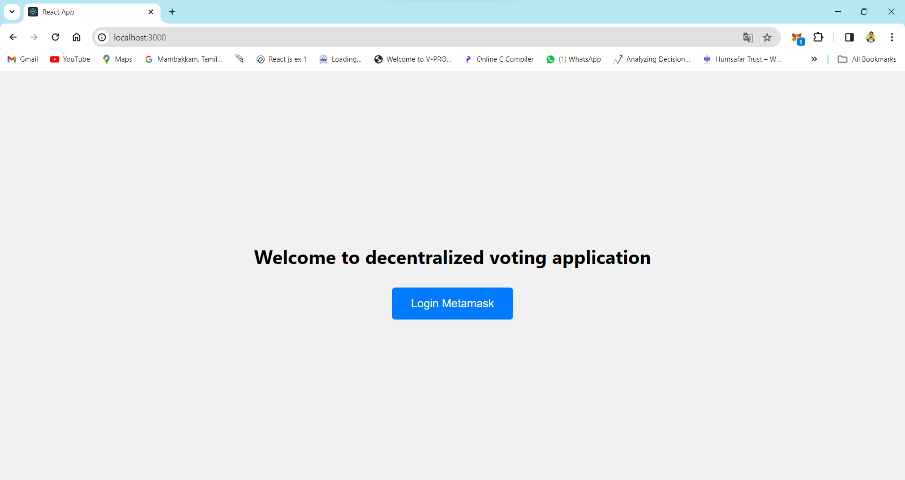
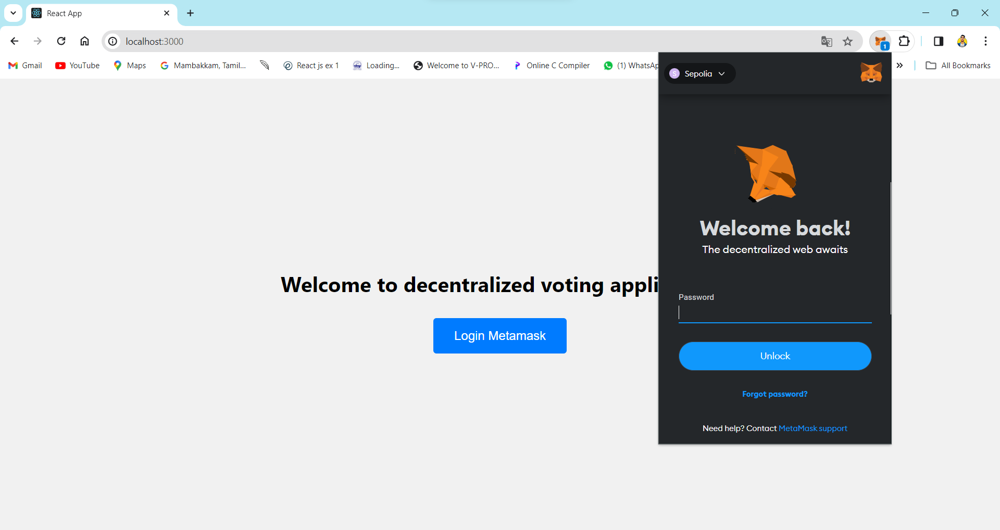
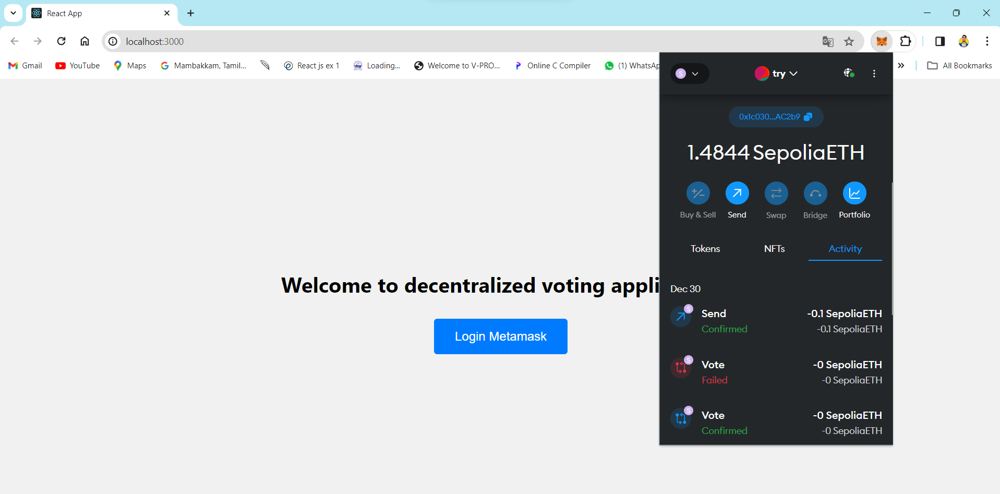
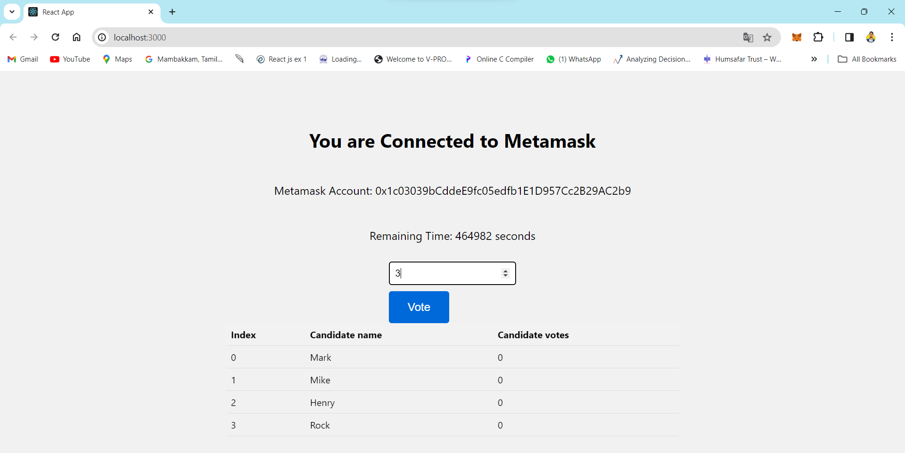
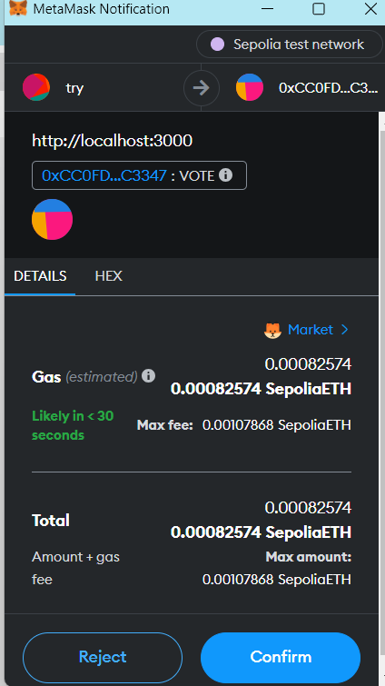
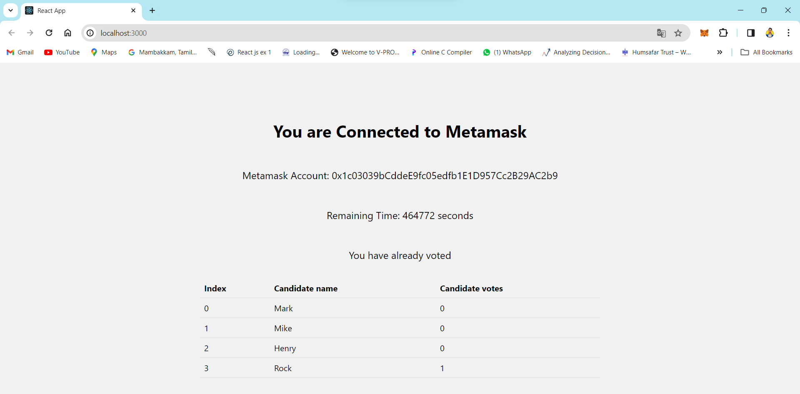

# Decentralized Voting Application

## Screenshots













## Installation

After you cloned the repository, you want to install the packages using

```shell
npm install
```

You first need to compile the contract and upload it to the blockchain network. Run the following commands to compile and upload the contract.

```shell
npx hardhat compile
npx hardhat run --network sepolia scripts/deploy.js
```

Once the contract is uploaded to the blockchain, copy the contract address and copy it in the .env file. You can also use another blockchain by writing the blockchain's endpoint in hardhat-config.

Once you have pasted your private key and contract address in the .env file, simply run command

```shell
npm start
```
